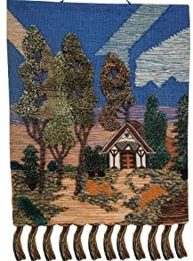
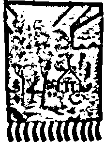
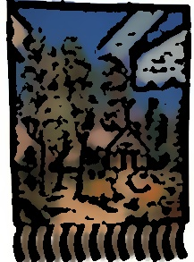
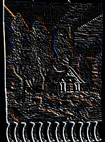
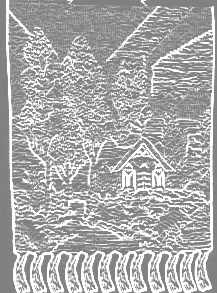
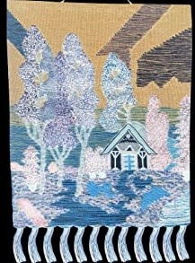
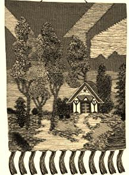
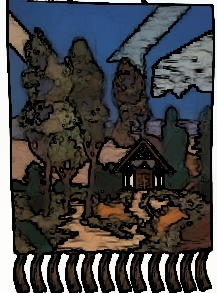

# OpenCV-Play
[](https://www.python.org/downloads/)
[](https://github.com/Nishikant00/OpenCV-Play/blob/main/.github/code_of_conduct.md)
[](https://github.com/Nishikant00/OpenCV-Play/blob/main/.github/pull_request_template.md)
[](https://github.com/Nishikant00/OpenCV-Play/blob/main/Contribution_Guidelines.MD)

### Note: Do not make a PR without getting the issues assigned. Read Rules Carefully! 

[](https://hacktoberfest.digitalocean.com)
<h2 align="center">Kickstart your Open-Source Journey:)</h2>

<h1 align="center">OpenCV-Play</h1>

Do you want to add variety of fun effects to your boring images? If yes, you have landed to the right repository.😄😄 

<!--  -->
## How to run the project

1. Clone/Download the repository.
```
git clone https://github.com/Nishikant00/OpenCV-Play.git
```

2. [Download & Install Python](https://www.python.org/downloads/)

3. Open the terminal & go to the project directory.
3. Now run
```
python effect_name.py --name [path of image]
```

4. If `ModuleNotFoundError` arises, try installing the module with:
```
pip install module_name
```
## Examples


|            Effect         |           Original Image    |           Image with Effect                |
|:----------------------------:|:-----------------------------:|:-------------------------------------:|
|         Cartoon Effect Black & White         ||  |
|         Cartoon Effect Colored        ||  |
|         Emboss Effect Colored        ||  |
|         Emboss Effect Grayscale        ||  |
|    Negative    ||  |
|          Sepia Effect            ||      |
|         Water Color Effect         ||  |
  
